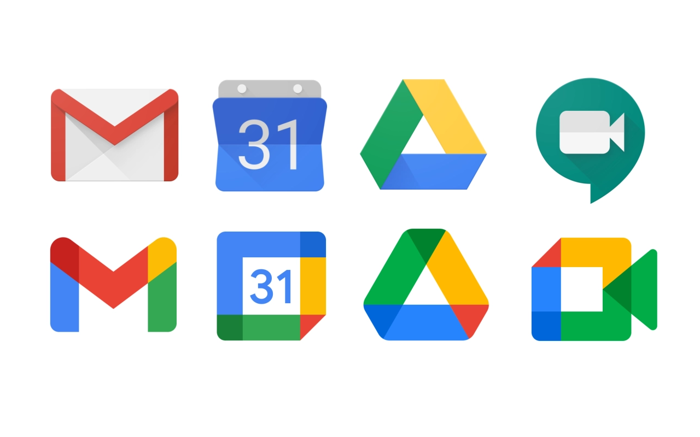

# Old Google Icons Browser Extension

> A browser extension that replaces the new Google icons with the classic ones.

## Install Links

TODO: Upload the extension to the relevant stores.

- [Firefox](https://addons.mozilla.org/en-US/firefox/addon/old-google-icons/)
- [Chrome]()
- [Edge]()

## How to contribute

Are you interested in adding new icons? Pull requests are welcomed! Here's how you can add a new icon:

1. In `manifest.json`, add the domain in `content_scripts.matches`.
2. In `content-script.js`, add a case for your new domain in `getFavicon()`.
   - We are using base64 encoded images for the replacement icons. You can use [Base64 Image Encoder](https://www.base64-image.de/) to convert an image into the base64 format.
   - You can find icons on [Icons8](https://icons8.com)
   - Before you encode the image, make sure the image is no bigger than 32px by 32px.
